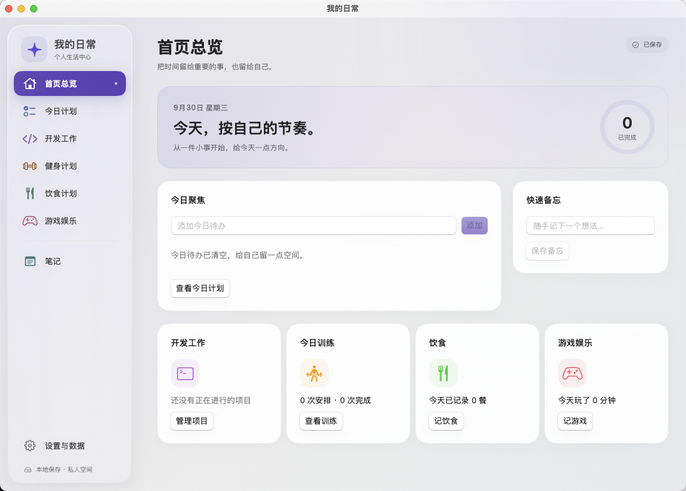
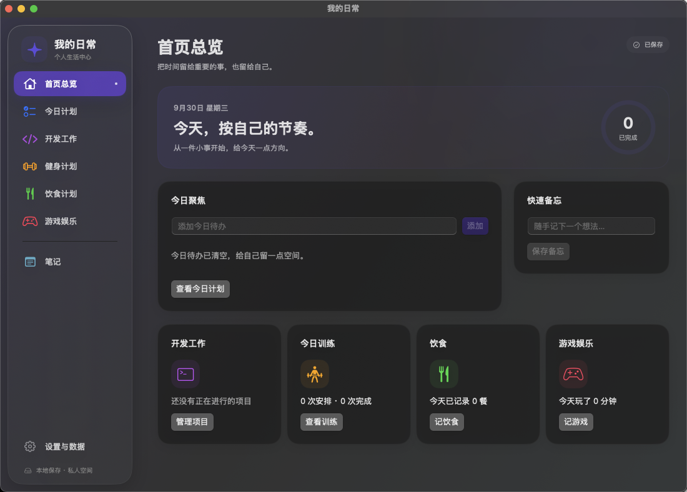

# 个人生活中心 · 视觉重构

工作分支：`design/liquid-glass-life-center`。基线：`9e0eead`。不合并或改写 main。

## 设计方向

采用安静的中性色内容底板、少量靛蓝环境色、悬浮导航和细腻边缘光。玻璃用于导航、日期控制及撤销反馈，内容区使用清晰的阅读表面，避免多层模糊叠加影响可读性。

- 导航：SF Symbols 固定 24 点图标列，统一 12 点图文间距，40 点点击高度。所有文字从同一列开始，包括游戏娱乐。选中态采用较深模块色保证白色标签对比，悬停提供轻量反馈。
- 首页：真实待办完成进度、今日聚焦、快速备忘和模块摘要；不添加虚构日程或示例数据。
- 今日计划：轻量日期控制、可整行点击的已完成展开入口，保留所有任务详情、完成与撤销操作。
- 开发：项目集合与工作内容保持分区，任务／问题／笔记／进展继续保留独立入口。
- 健身：训练状态胶囊、动作分组和实际数据记录区，明确计划与实际的区别。
- 饮食：热量与蛋白质分别呈现，餐次采用时间意象，计划与实际仍并排独立编辑。
- 游戏：时长优先的排版和轻量记录卡，保留编辑、删除及非法时长反馈。
- 笔记：明确的笔记集合区域、更宽松的正文阅读表面、自动保存状态。
- 设置：通知、存储和备份分区；不隐藏路径、失败提示或恢复确认。
- 编辑面板：统一留白和文本区域，原有必填、取消、保存与错误反馈保留。
- 图标：使用 AppKit 本地绘制矢量形状，构建时生成全部分辨率的 icns，不依赖网络资源。

## 材质与系统兼容

开发机器为 macOS 15.6。`GlassSurface` 在 macOS 26 及以上调用原生 `glassEffect`；在 macOS 14/15 使用原生 `ultraThinMaterial`、细边缘高光和轻阴影提供兼容外观。不能将 macOS 15 的兼容材质描述成 macOS 26 原生 Liquid Glass 的实际运行效果。

启用减少透明度时使用实色表面；增加对比度时提高内容边框对比。减少动态效果时取消导航悬停动画和定位滚动动画。遵循系统深浅色外观，未修改用户系统主题。

参考：[Apple Materials](https://developer.apple.com/design/human-interface-guidelines/materials)、[Applying Liquid Glass to custom views](https://developer.apple.com/documentation/swiftui/applying-liquid-glass-to-custom-views)。

## 界面预览

以下为 macOS 15.6 兼容材质的实际应用窗口截图，来自隔离 UI 测试，不包含个人记录。

## 功能保护与验证

不修改 `LifeCore`、`AppModel`、通知管理器或现有文件格式。不引入账号、网络、云服务或外部字体。

保留原有全部功能与 UI 验收用例。已完成列表由箭头控件改为整行按钮，因此测试仅替换控件定位，仍断言展开状态、完成记录、删除撤销和重新启动后的记录。新增侧栏尺寸一致性与深色外观页面检查。所有 UI 测试使用独立应用标识和临时数据。

2026-09-30 最终执行 `bash scripts/test-all.sh` 全部通过：45 项核心／应用模型测试、11 项 UI 测试，以及独立进程保存与恢复、断网运行、系统通知登记／替换／取消／应用退出后交付、仓库隐私检查。UI 结果：`.build/UIResults-20260930-004928.xcresult`。

保留全部原有验收，新增深色外观和八个模块的小窗口检查。检查了浅色／深色首页、小窗口两列摘要和训练实际数据布局。中途发现系统文件框输入事件超时，恢复测试增加明确点击路径输入框、全选和输入值核对后，重新完整执行并通过，没有跳过测试或降低断言。

macOS 26 原生分支可编译，但本机不能进行 macOS 26 实机验收。第一版原有的真实电脑重启、休眠和通知点击人工验收事项仍独立保留，此次视觉重构不将它们标为通过。
